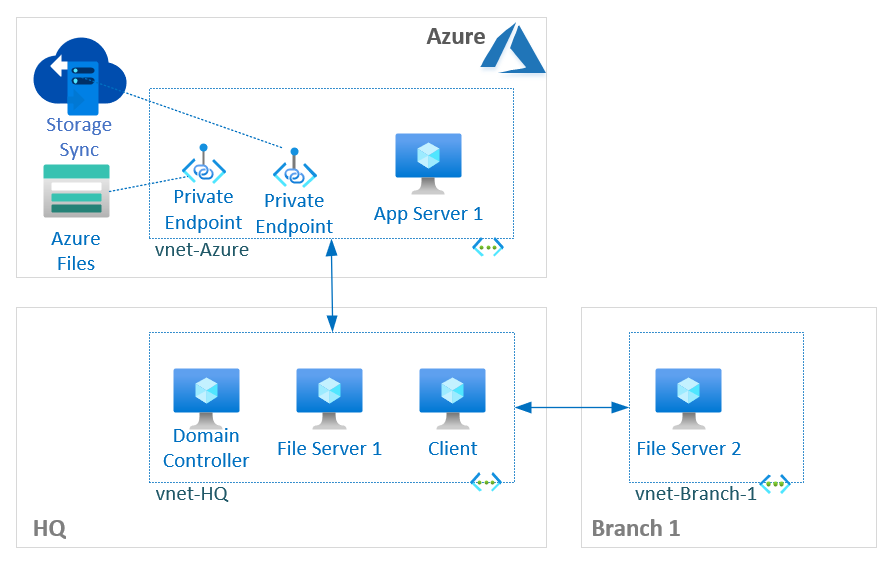

# Azure Files MicroHack (bicep)

## Introduction

The Azure Files MicroHack walks through the setup of Azure Files in an hybrid environment with Azure File Sync and helps understand various features.

## Learning Objectives
We often see new customers onboarding to Azure Files or looking to run PoC to validate the service, try file server migration, tools, approach, etc. struggle with deployment and look for lab environment to play around the setup and tools. Azure Files MicroHack helps by providing an automated lab environment (using arm/bicep) to mimic an on-prem environment with Domain Controller, File Servers (with Branch Site), DFS-N (pending), dummy data. Using Azure Files storage and Sync service, you will setup a hybrid file share experience with cloud tiering, work through various file share requirements like remote branch site access, tiering policies.
More scenarios/challenges will be added later.

1. Provision an on-premise environment (automated with DSC, bicep)
2. Set up Azure Files and File Sync service
3. Sync files data
4. Config Private Endpoint
5. Enable on-premises AD DS Auth
TBC - to be reviewed updated based on lab scenario around AD integration, feasibility etc.

## Challenges
1. Challenge 0: **[Deploy lab using template](bicep/)**
   - Deploy the base environment for the lab using Azure subscription. 
2. Challenge 1: **[Setup Azure Files and File Sync Service](Student/Challenge-01.md)**
   - Create Azure Files share, setup and config Storage Sync Service.
3. Challenge 2: **[Configure Server endpoint and Cloud tiering](Student/Challenge-02.md)**
   - Config HQ File Server endpoint and setup cloud tiering.
4. Challenge 3: **[Add Branch File Server as a new server endpoint](Student/Challenge-03.md)**
   - Config Branch File Server to replicate/sync the files from Azure Files.
5. Challenge 4: **[Enable Data Protection - Snapshot or Azure Backup](Student/Challenge-04.md)**
   - Review soft delete feature, manage snapshots, and configure Azure Backup.
6. Challenge 5: **[Secure Azure File Share with Private Endpoint](Student/Challenge-04.md)**
   - Configure storage firewall and enable private endpoint for secure access to Azure file share.

## Prerequisites
- Your own Azure subscription with Owner access
- Visual Studio Code
- Az PowerShell Module

## Challenge 0: Deploy lab bicep/arm template
Deploy the base environment for the lab using the bicep/arm template in your Azure subscription. This will deploy the following components using 3 different Azure regions:
- On-prem (HQ - North Europe and Branch Site - UK South):
    - HQ Domain Controller - contoso.com (vm-hq-dc)
    - HQ File Server (vm-hq-fs-1)
    - Client Machine (vm-hq-client-1)
    - Branch File Server (vm-branch1-fs-1)
- Azure (Hub - West Europe)
    - Virtual Network (vnet-azhub)
    - Azure App VM (vm-az-app-1)
- Azure Bastion
- Used VNet peering for simplified connectivity between HQ and Branch, HQ and Azure Hub.

### Deploy lab template using templates

Steps to deploy Azure Files lab environment:

1. Fork this GitHub repo and clone to your computer with latest Azure Powershell module or Azure CLI.
2. Login to your Azure subscription using PowerShell or Azure CLI.
    - AZ CLI: az login
    - PowerShell: Connect-AzAccount
        - az account set --subscription "Subscription Name"
3. Create a resource group in Azure where lab environment will be deployed.
    - AZ CLI: az group create -n 'rg-lab-afs' -l 'westeurope'
    - PowerShell: New-AzResourceGroup -Name 'rg-lab-afs' -Location 'westeurope'
4. (Optional) Modify parameter values within "./bicep/azfiles-lab.parameters.json" file if required.
5. Initiate template deployment.
    - Switch to the .\bicep\ folder. 
    - AZ CLI:  az deployment group create -g 'rg-lab-afs' -f .\azfiles-lab.json --parameters .\azfiles-lab.parameters.json
    - Powershell: New-AzResourceGroupDeployment -Name AzFilesLab -ResourceGroupName 'rg-lab-afs' -TemplateFile .\azfiles-lab.json -TemplateParameterFile .\azfiles-lab.parameters.json
6. Type password to be used for all accounts (including domain admin) in your lab environment. Be sure to remember that password as you will need it to log into the lab environment.
7. Wait for deployment to finish, it should take around 30 minutes for deployment to finish.

### Validate Lab
Steps to check connectivity and validate whether DSC has completed the required configurations for the base lab to start with various challenges (exercises) below.

1. Connect to all VMs using Bastion.  
*Note: if you haven't changed deployment parameters, default administrator username will be 'azadmin'; use the password that you entered as parameter at the start of deployment; default domain name is 'contoso.com')*
2. Validate Domain Controller, check Computers OU objects - make sure all machines are domain joined.
3. Connect to HQ File Server, validate F:\Share1 exist with some dummy folder and files.
4. Connect to HQ-Client-1, open elevated command prompt or powershell and run below command to map the file share to a local M: drive on the VM.
    - net use M: \\vm-hq-fs-1\Share1 /persistent:Yes
5. Edge browser is deployed on servers for internet access/file downloads.

## Challenge 1: Setup Azure Files and File Sync Service
Create Azure Files share, setup and config Storage Sync Service.

1. Create an Azure Storage account and file share
    - Select 'transaction optimized' tier as thats most cost effective during initial sync/migration. During production deployment, its suggested to start with transaction optimized and switch to the right **[storage tier](https://docs.microsoft.com/en-us/azure/storage/files/storage-files-planning#storage-tiers)** - Cool/Hot/Transaction Optimized after reviewing the workload use case, data churn pattern/transaction units, data size and bill.
    - Follow https://docs.microsoft.com/en-us/azure/storage/files/storage-how-to-create-file-share?tabs=azure-portal

2. Deploy Azure File Sync service from marketplace (aka Storage Sync Service)
    - Follow https://docs.microsoft.com/en-us/azure/storage/files/storage-sync-files-extend-servers#deploy-the-service

3. Deploy Azure File Sync Agent on HQ File Server (vm-hq-fs-1)
    - Use Azure Bastion to connect to the VM
    - Install Azure Az powershell module (Note: already deployed in lab VM via DSC) 
    - Use Edge browser to download the Azure File Sync Agent.
    - For download link and instructions, follow https://docs.microsoft.com/en-us/azure/storage/files/storage-sync-files-extend-servers#install-the-agent

4. Register HQ File Server with Storage Sync Service
    - Follow https://docs.microsoft.com/en-us/azure/storage/files/storage-sync-files-deployment-guide?tabs=azure-portal%2Cproactive-portal#register-windows-server-with-storage-sync-service
    - Go to Storage Sync Service, under Sync > Registered Servers. Validate if you can see the HQ file server (vm-hq-fs-1) with Online state.

5. Create a Sync Group with a Cloud Endpoint (Azure files storage)
    - Follow https://docs.microsoft.com/en-us/azure/storage/files/storage-sync-files-deployment-guide?tabs=azure-portal%2Cproactive-portal#create-a-sync-group-and-a-cloud-endpoint

## Challenge 2: Configure Server endpoint and Cloud tiering
Create HQ File Server endpoint and configure cloud tiering.

1. Create a Server Endpoint for HQ File Server using data path 'F:\Share1' which has pre-created dummy data files.
    - Server endpoint config:
        - Registered Server: vm-hq-fs-1.contoso.com
        - Path: F:\Share1
        - **[Cloud Tiering](https://docs.microsoft.com/en-us/azure/storage/files/storage-sync-cloud-tiering-overview)**: Disabled
        - Initial Download: Recall the namespace first (default option).
        - For more info refer **[Sync policies that affect cloud tiering](https://docs.microsoft.com/en-us/azure/storage/files/storage-sync-cloud-tiering-overview#sync-policies-that-affect-cloud-tiering)**.
        - **[Offline Data Transfer](https://docs.microsoft.com/en-us/azure/storage/files/storage-sync-offline-data-transfer)**: Disabled
    - For instructions, refer https://docs.microsoft.com/en-us/azure/storage/files/storage-sync-files-deployment-guide?tabs=azure-portal%2Cproactive-portal#create-a-server-endpoint
    - Let file sync do the full upload to the Azure file share (cloud endpoint).
    - Azure File Sync runs a process to detect the files in the cloud before starting the initial sync. The time taken to complete this process varies depending on the various factors like network speed, available bandwidth, and number of files and folders. For the rough estimation in the preview release, detection process runs approximately at 10 files/sec. Hence, even if pre-seeding runs fast, the overall time to get a fully running system may be significantly longer when data is pre-seeded in the cloud.

2. Go to Sync group, if the server endpoint is in Pending (health) state, wait couple of mins and click refresh.The status will change to green check (healthy) and sync activity will say "Upload & Download".

3. Select the server endpoint (click on file server name) to see a detailed status like last completed sync sessions. A green Health column and a Files Not Syncing value of 0 indicate that sync is working as expected. 
    - After few mins, the sync activity will say "Upload" and show sync status (# files / data size remaining) with last sync timestamp.
    - If this is not the case, refer the troubleshooting article https://docs.microsoft.com/en-us/azure/storage/files/storage-sync-files-troubleshoot?tabs=portal1%2Cazure-portal to check common sync errors and how to handle files that are not syncing.

4. Go to Azure File Share and see whether the data on F:\Share1 is listed. Navigate through the folder structure and try accessing the files.

5. Connect to HQ Client VM (vm-hq-client-1), access mapped M: drive or share path \\vm-hq-fs-1\Share1.

6. Modify files (add folders, files or change content on an existing file) on Share1. The changes should be synchronized immediately on Azure File share.

More info on Cloud tiering: https://docs.microsoft.com/en-us/azure/storage/files/storage-sync-cloud-tiering-overview

## Challenge 3: Add Branch File Server as a new server endpoint
Config Branch File Server (no file shares) to replicate/sync the files from Azure Files. The idea is to have a local cache of often/recently accessed (hot) files in branch file server for branch users. Configure cloud tiering policy.

1. Create a folder 'F:\HQ-BR_Share' in Branch File Server (vm-branch1-fs-1)

2. Deploy Azure File Sync Agent

3. Register Branch File Server with Storage Sync Service

4. Add Branch File Server 'F:\HQ-BR_Share' as a new server endpoint to existing Sync Group.
    - Server endpoint config:
        - Registered Server: vm-branch1-fs-1.contoso.com
        - Path: F:\HQ-BR_Share
        - **[Cloud Tiering](https://docs.microsoft.com/en-us/azure/storage/files/storage-sync-cloud-tiering-overview)**: Enabled
            - Volume Free Space Policy: 20 (default)
            - Date Policy: Enabled, 7 days
        - Initial Download: Recall the namespace only
        - For more info refer **[Sync policies that affect cloud tiering](https://docs.microsoft.com/en-us/azure/storage/files/storage-sync-cloud-tiering-overview#sync-policies-that-affect-cloud-tiering)**.
        - **[Offline Data Transfer](https://docs.microsoft.com/en-us/azure/storage/files/storage-sync-offline-data-transfer)**: Disabled
    - Follow https://docs.microsoft.com/en-us/azure/storage/files/storage-sync-files-server-endpoint

## Challenge 4: Enable Data Protection - Snapshot or Azure Backup
Create snapshots, and configure Azure Backup.

1. Snapshot Management
    - Refer https://docs.microsoft.com/en-us/azure/storage/files/storage-snapshots-files
    - Go to Azure File share. Under operations blade, you can see all the snapshots for this file share. 
    - Take a manual snapshot by going to Azure File share > Snapshots. Click Add Snapshot, provide a comment and select Ok.
    - Corrupt a file by making some changes to a file under HQ File share from the file server like deleting a line or overwriting the content with something. Check whether the file have sync'd to cloud.
    - To restore the corrupt file, go to Azure file share > Snapshots > Select the last snapshot created. You can access all the folder and files from the snapshot and restore just the corrupted file to its original location. Select the file to restore, click Restore. Select overwrite original file.
    - Check if the file restored was successful and verify the original content.

2. Enable backup for file share using Azure Backup
    - Follow steps here below to create a Recovery Services Vault and configure backup.
    - Steps: https://docs.microsoft.com/en-us/azure/backup/backup-afs?toc=/azure/storage/files/toc.json

3. Run an on-demand backup job (Backup Now)
    - Follow https://docs.microsoft.com/en-us/azure/backup/backup-afs?toc=/azure/storage/files/toc.json#run-an-on-demand-backup-job

4. Once backup job is complete, delete few files/folders from HQ File Server.

5. Restore files to original location using Azure Backup - Restore operation.
    - You can do a full share recovery to original location or another location and also perform item-level recovery.
    - Follow https://docs.microsoft.com/en-us/azure/backup/restore-afs?toc=/azure/storage/files/toc.json

## Challenge 5: Secure Azure File Share with Private Endpoint
Configure storage firewall (restrict public endpoint) and enable private endpoint for secure access to Azure file share.

TBD: Expand on this lab scenario. More prescriptive guidance to be added.

1. Create Private endpoint
    - Follow https://docs.microsoft.com/en-us/azure/storage/files/storage-files-networking-endpoints?tabs=azure-portal

2. Restrict Public endpoint access
    - Follow https://docs.microsoft.com/en-us/azure/storage/files/storage-files-networking-endpoints?tabs=azure-portal#restrict-public-endpoint-access

## Monitor Azure File Sync
To view health of the File sync deployment and sync status: https://docs.microsoft.com/en-us/azure/storage/files/storage-sync-files-monitoring 

## More Info on Azure Files and File Sync

- **[Planning for an Azure Files Deployment](https://docs.microsoft.com/en-us/azure/storage/files/storage-files-planning)**
- **[Planning for an Azure File Sync Deployment](https://docs.microsoft.com/en-us/azure/storage/files/storage-sync-files-planning)**
- Recommended Sessions:
    - https://www.youtube.com/watch?v=H04e9AgbcSc
    - https://www.youtube.com/watch?v=m5_-GsKv4-o

## Delete your lab
- When you are finished to cleanup the entire lab, just delete the resource group "rg-afs-lab".
    - AZ CLI: az group delete -n 'rg-lab-afs'
    - PowerShell: Remove-AzResourceGroup -Name 'rg-lab-afs'

## Contributors
- Andrej Kasnik
- Jithin P P
